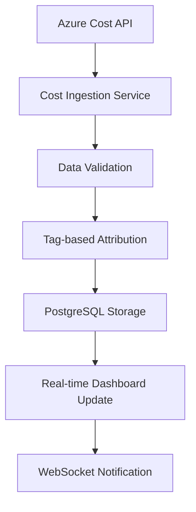
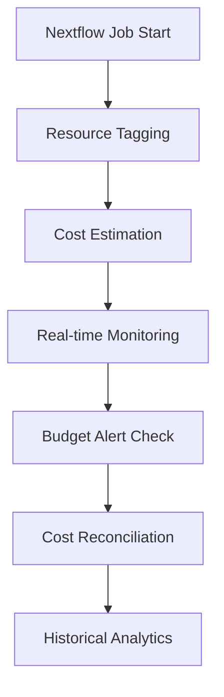

# Technical Architecture - GenomeCostTracker

## System Overview

GenomeCostTracker is designed as a microservices architecture optimized for cost-effective deployment while providing enterprise-grade genomics cost monitoring.

## Core Components

### 1. Cost Data Pipeline
```
Azure Cost Management API → Cost Ingestion Service → PostgreSQL → Real-time Dashboard
                          ↓
                    Cost Estimation Engine
                          ↓
                    Reconciliation Service
```

### 2. Workflow Integration Layer
```
Nextflow Pipeline → Resource Tagging → Azure Resources → Cost Attribution
                 ↓
            Job Metadata Capture → Database Storage
```

### 3. Real-time Monitoring System
```
WebSocket Connections ← Dashboard Updates ← Cost Change Detection
                     ↓
              Alert Engine → Notification Service
```

## Database Schema

### Core Tables
- `organizations` - Multi-tenant support
- `azure_connections` - Azure service principal configs
- `genomics_jobs` - Nextflow job metadata
- `cost_data` - Actual Azure costs with attribution
- `cost_estimates` - Real-time cost predictions
- `budget_alerts` - Alert configurations and history
- `optimization_recommendations` - AI-generated cost savings

### Key Relationships
```sql
organizations (1) → (N) azure_connections
genomics_jobs (1) → (N) cost_data
genomics_jobs (1) → (1) cost_estimates
```

## Azure Integration Points

### 1. Cost Management API
- **Endpoint**: `/providers/Microsoft.CostManagement/query`
- **Scope**: Subscription, Resource Group, or Resource level
- **Frequency**: Every 4 hours (Azure billing delay)
- **Data**: Actual costs with resource tags

### 2. Azure Resource Manager (ARM)
- **Purpose**: Resource discovery and tagging
- **Permissions**: Reader + Tag Contributor
- **Scope**: Subscription level for genomics resource groups

### 3. Azure Batch Service
- **Integration**: Job monitoring and cost prediction
- **Metrics**: Node hours, task execution time, queue depth
- **Cost Model**: Dedicated vs Low-priority node pricing

## Cost Estimation Algorithm

### Real-time Estimation Formula
```python
estimated_cost = (
    compute_cost_per_hour * estimated_runtime_hours +
    storage_cost_per_gb * data_size_gb * retention_days +
    network_cost_per_gb * data_transfer_gb +
    container_cost_per_hour * container_runtime_hours
)
```

### Reconciliation Process
1. Compare estimates with actual Azure costs (24-48h delay)
2. Calculate accuracy metrics per workflow type
3. Adjust estimation models using ML feedback loop
4. Update cost predictions for similar future jobs

## Security Architecture

### Authentication Flow
```
User Login → JWT Token → API Gateway → Service Authentication
          ↓
    Refresh Token → Token Renewal → Continued Access
```

### Azure Service Principal
- **Principle of Least Privilege**: Cost Management Reader only
- **Rotation**: Automated 90-day credential rotation
- **Monitoring**: Failed authentication alerts

## Scalability Design

### Horizontal Scaling Points
- **API Layer**: Stateless FastAPI instances behind load balancer
- **Database**: PostgreSQL read replicas for analytics queries
- **Background Jobs**: Celery workers for cost data ingestion

### Performance Optimizations
- **Caching**: Redis for frequently accessed cost data
- **Indexing**: Optimized database indexes for time-series queries
- **Compression**: Gzip compression for API responses

## Monitoring & Observability

### Key Metrics
- API response times (p95 < 200ms)
- Cost estimation accuracy (>90%)
- Azure API rate limit usage (<80%)
- Database query performance

### Alerting Thresholds
- High API error rates (>5%)
- Cost estimation drift (>20% variance)
- Azure API quota exhaustion
- Database connection pool saturation

## Deployment Architecture

### Production Environment
```
Internet → Cloudflare CDN → Vercel (Angular) → Railway (FastAPI) → Supabase (PostgreSQL)
                          ↓
                    Background Workers (Railway)
                          ↓
                    Azure Cost Management API
```

### Development Environment
- Local Docker Compose setup
- Mock Azure API responses for testing
- Seed data for genomics workflows

## Data Flow Diagrams

### Cost Data Ingestion


### Workflow Cost Tracking
